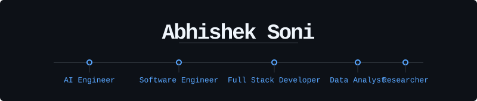

  

  <samp>
    BSc (Hons) Computer Science · University of Greenwich 
    Building systems where machine learning meets infrastructure.
  </samp>

 

## Selected Work

**Predictive IoT Maintenance Framework**  
`Python` · `LSTM` · `ARIMA` · `PPO` · `DQN`  
├── Hybrid forecasting + reinforcement learning under uncertainty  
├── Closed-loop state-aware optimisation architecture  
└── Reduced simulated downtime by 20%

**Network Distributed Chat System**  
`Java` · `Concurrency` · `Distributed Systems`  
├── Fault-tolerant multi-client communication  
├── Concurrency-safe message routing  
└── Resilience under partial failure and network partition

**Automated Banking Transaction Categorisation**  
`Python` · `Scikit-learn` · `Pandas`  
├── ML-based financial transaction classifier  
├── Automated spending pattern detection  
└── Production-ready categorisation pipeline

 

## Trace

**NovAzure, London** — Software Engineering Intern  
FastAPI microservices and multi-source data pipelines for Net Zero reporting.

**University of Greenwich** — Data Research Assistant  
10,000+ record analysis, executive dashboards, REC & Athena Swan submissions.

 

## Systems
